# 固定滤波器ANC实验

固定滤波器实验是主动降噪（ANC）研究的基础环节。

目前，我们采用MATLAB工具生成实验数据，探索辨识模型及其可实现的最优性能。实验中，主通路和次通路均采用长度为512的FIR模型，并针对不同频段生成参考噪声，分别开展实验以验证效果，为后续研究奠定基础。

推荐的噪声文件命名规范如下：

```
[噪声类型]_[频段下限]T[频段上限]Hz_Fs[采样率]_[滤波器类型]Order[阶数]_[日期].bin
```

示例：
```
单频噪声：
    200Hz           → Sine_200_Fs48kHz_FIROrder512_Q123.bin
    500Hz         
    1000Hz

    
    1500Hz
    2000Hz
窄带噪声：
    200,400,600Hz    → Harmonic_Base200_Fs48kHz_FIROrder512_Q123.bin
    300,600,900Hz    → Harmonic_Base300_Fs48kHz_FIROrder512_Q123.bin
    400,800,1200Hz   → Harmonic_Base400_Fs48kHz_FIROrder512_Q123.bin
    500,1000,1500Hz  → Harmonic_Base500_Fs48kHz_FIROrder512_Q123.bin
宽带噪声：
    200~300Hz    → BB_200T300Hz_Fs48kHz_FIROrder512_Q123.bin
    200~500Hz    → BB_200T500Hz_Fs48kHz_FIROrder512_Q123.bin
    200~1000Hz   → BB_200T1000Hz_Fs48kHz_FIROrder512_Q123.bin
    500~600Hz    → BB_500T600Hz_Fs48kHz_FIROrder512_Q123.bin
    500~800Hz    → BB_500T800Hz_Fs48kHz_FIROrder512_Q123.bin
    500~1000Hz   → BB_500T1000Hz_Fs48kHz_FIROrder512_Q123.bin
宽频噪声：
    200~2000Hz   → WB_200T2000Hz_Fs48kHz_FIROrder512_Q123.bin
环境噪声：
    电路板电磁噪声 → ENV_ElecBoardEMI_Fs48kHz_Q123.bin
    发电机噪声     → ENV_Generator_Fs48kHz_Q123.bin
    风扇噪声       → ENV_Fan_Fs48kHz_Q123.bin
    教室噪声       → ENV_Classroom_Fs48kHz_Q123.bin
    拖拉机噪声     → ENV_Tractor_Fs48kHz_Q123.bin
```

## 1. 单频噪声测试

* 200Hz：95.4→93.0，降噪效果极差，主观听感反而更吵
* 500Hz：98.5→72.4
* 1000Hz：92.1→68.4
* 1500Hz：89.5→60.6
* 2000Hz：84.0→70.1

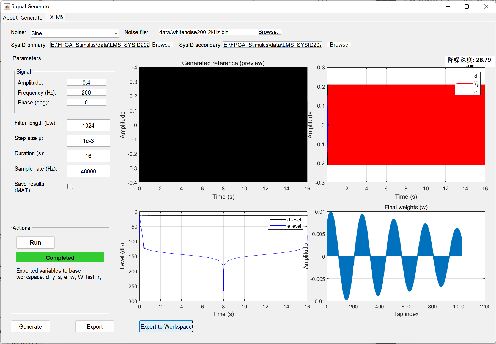

## 2. 谐波噪声测试

### 200Hz谐波

理论降噪深度23.92dB，实际效果微弱（92.6dB→92.3dB）

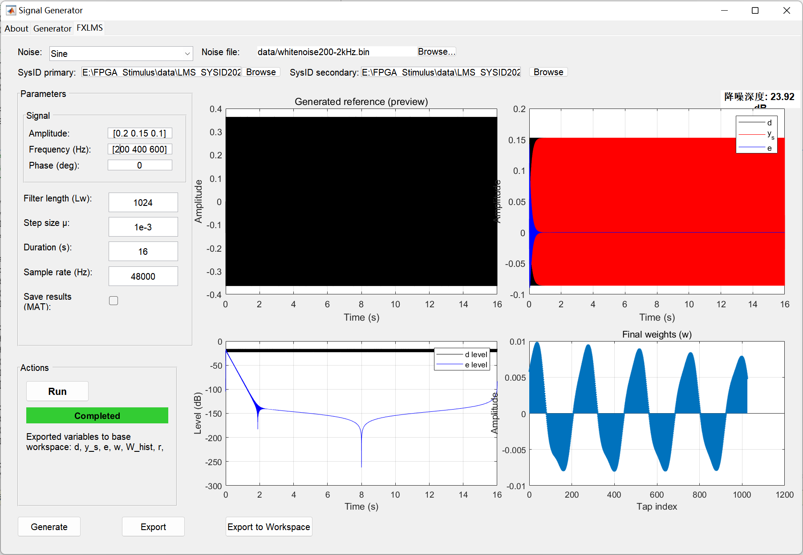

### 300Hz谐波

理论降噪深度28.59dB，实际92.8→83.9

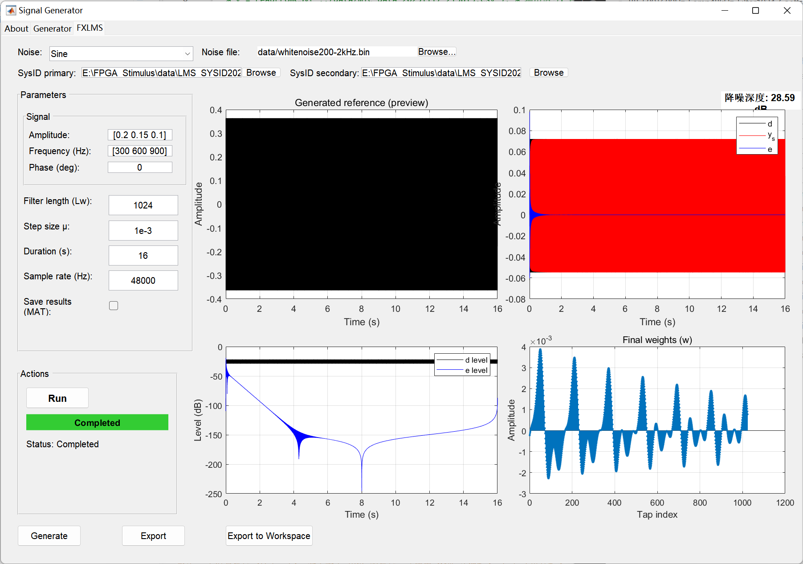

### 400Hz谐波

理论降噪深度27.73dB，实际93.1→78.7

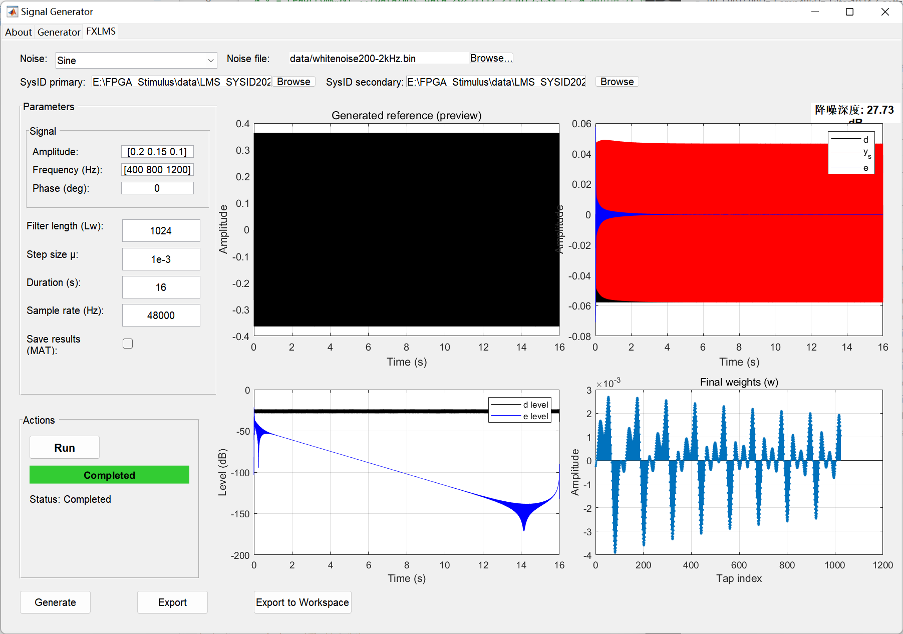

### 500Hz谐波

理论降噪深度27.62dB，实际93.9→63.5

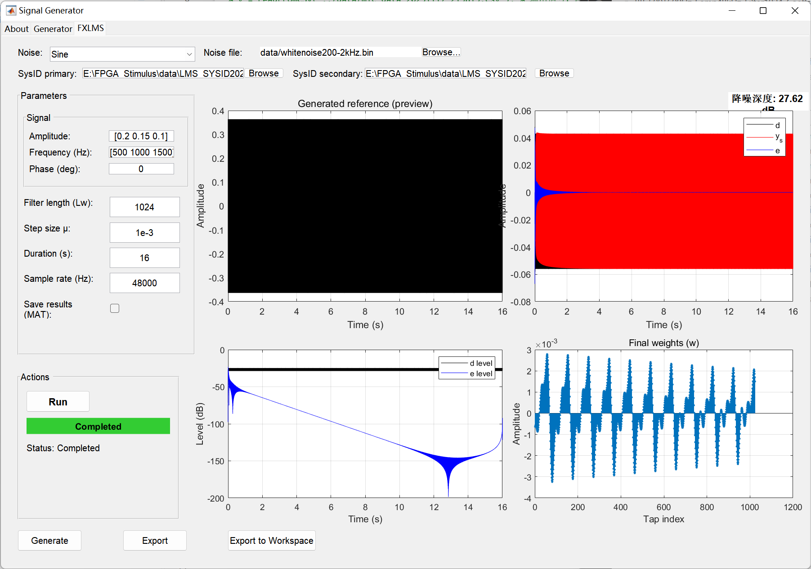

## 3. 宽带噪声测试

### BB200T300

理论降噪约11.91dB，实际约6.9dB（82.6dB→75.7dB）。

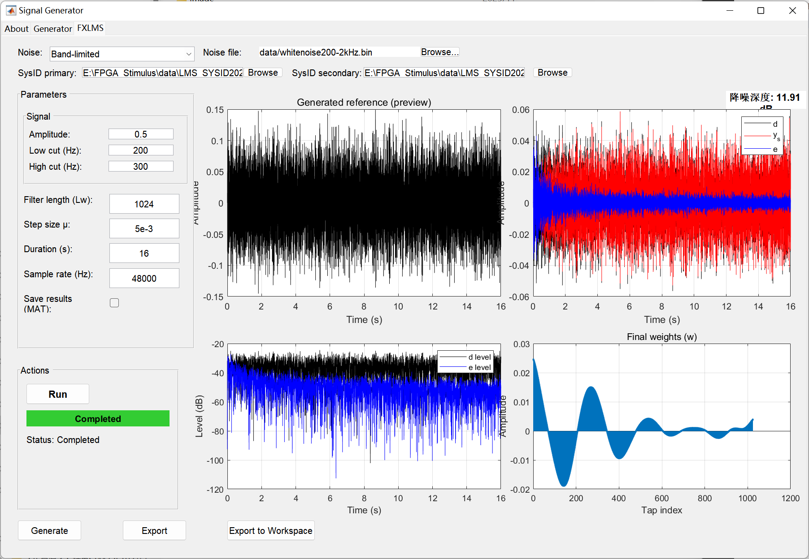

### BB200T500

理论降噪约13dB，实际约10.5dB（85.1dB→74.6dB）

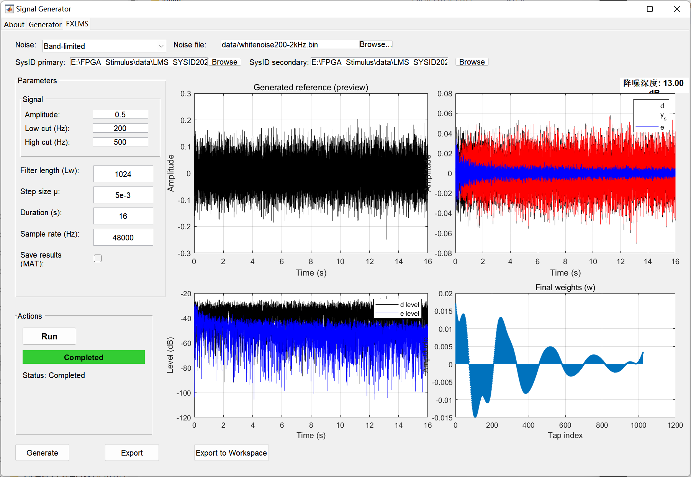

### BB200T1000

理论降噪约13.78dB，实际12.9dB（88.3dB→75.4dB）

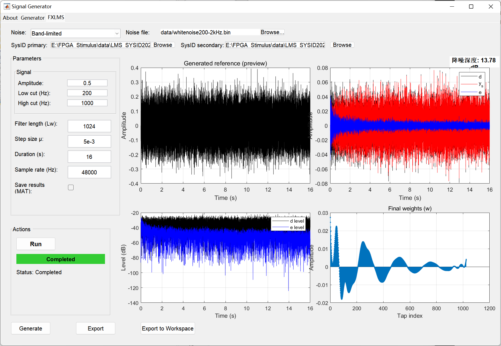

### BB300T500

理论降噪约13.45dB，实际（手持声级计测量）约18dB（83dB→65dB）。

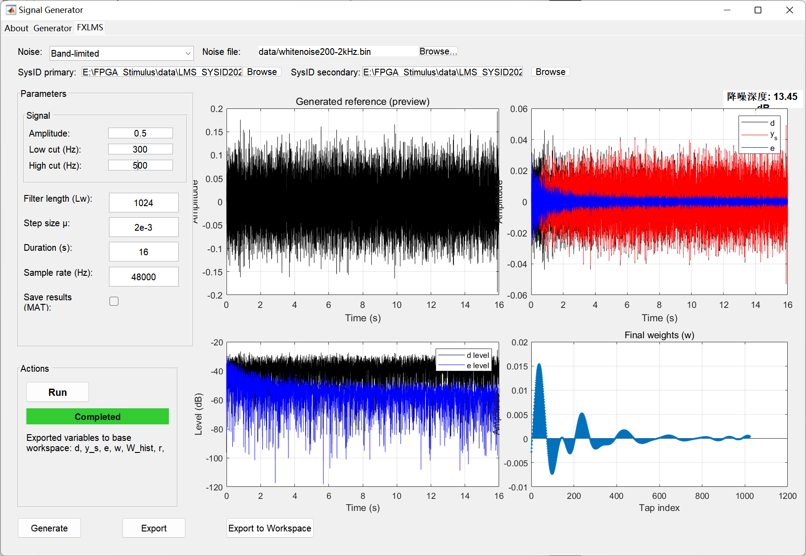

### BB300T700

理论降噪约14dB，实际18.7dB（86.5dB→67.8dB）。


### BB500T600

理论降噪17.45dB，实际数据待补充

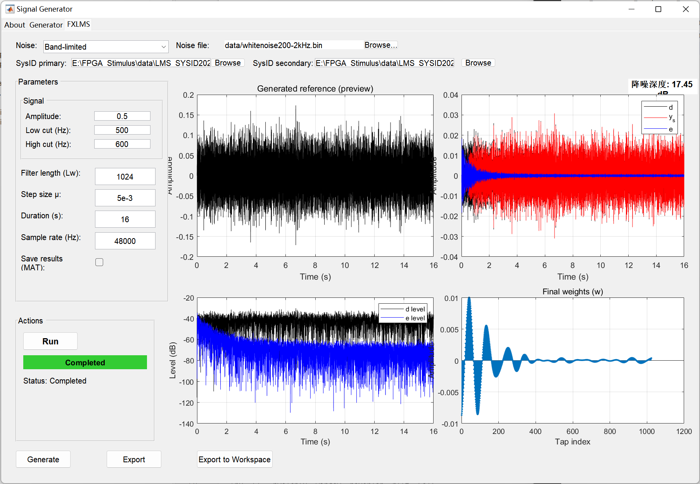

### BB500T800

理论降噪15.71dB，实际22.9dB（81.5dB→58.6dB，88.8dB→64.7dB）。

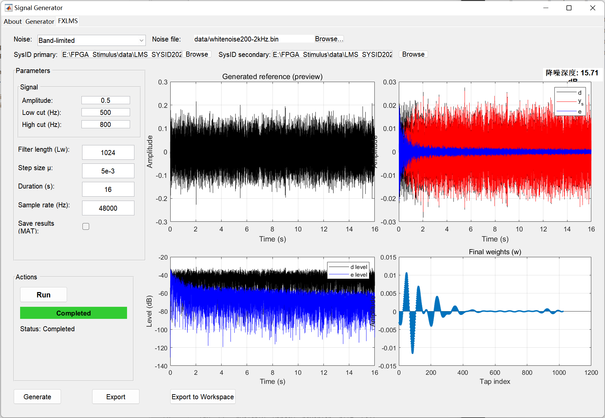

### BB500T1000

理论降噪15.62dB，实际21.3dB（83.5dB→62.2dB，89.4dB→68.5dB）

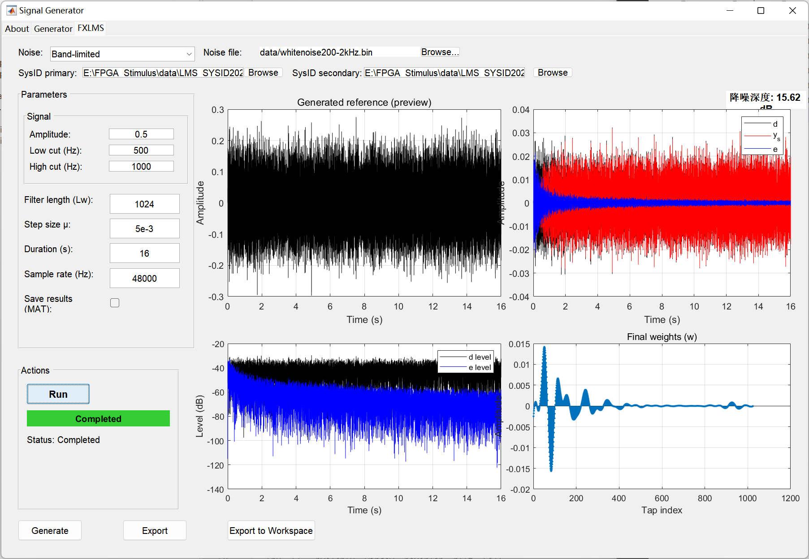

### WB200T2000

理论降噪13.47dB，实际13.4dB（88.7dB→75.3dB，92.4dB→83.6dB）

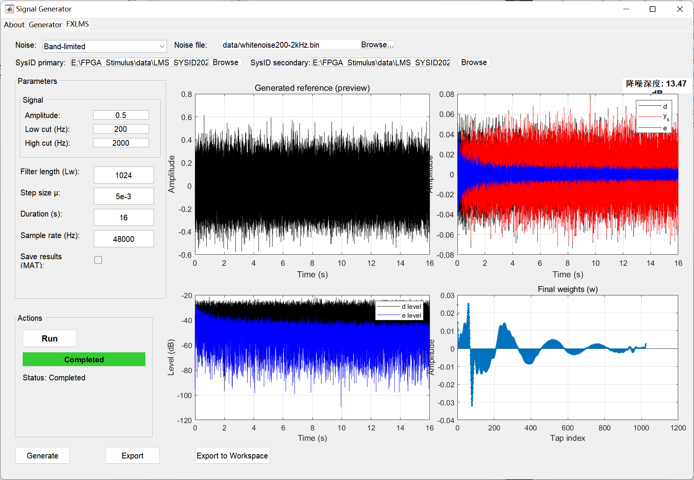

## 4. 环境噪声测试

## 特殊情况

在新管道中，由于结构的设计，主扬声器的陈设成为一个问题，在扬声器摆放的位置/姿态不好时，可能出现下图中不同的情况。其中，主通路辨识数据在许多频段内表现出相干性差的问题。**这可能与扬声器贴近金属框架放置有关。**

<figure align = center>
    
    
</figure>

经仿真初步考察，在这些频段内主通道的噪声可能无法正确传达到扬声器中，结果是这些频段的基础噪声不大，降噪效果不明显/容易放大。


## 实验注意事项与调试记录

**注意：实验时不建议选用幅值过大的辨识序列或主噪声，否则可能超出扬声器性能极限，导致失真和噪声，严重影响输入输出的相干性及实验效果。**
